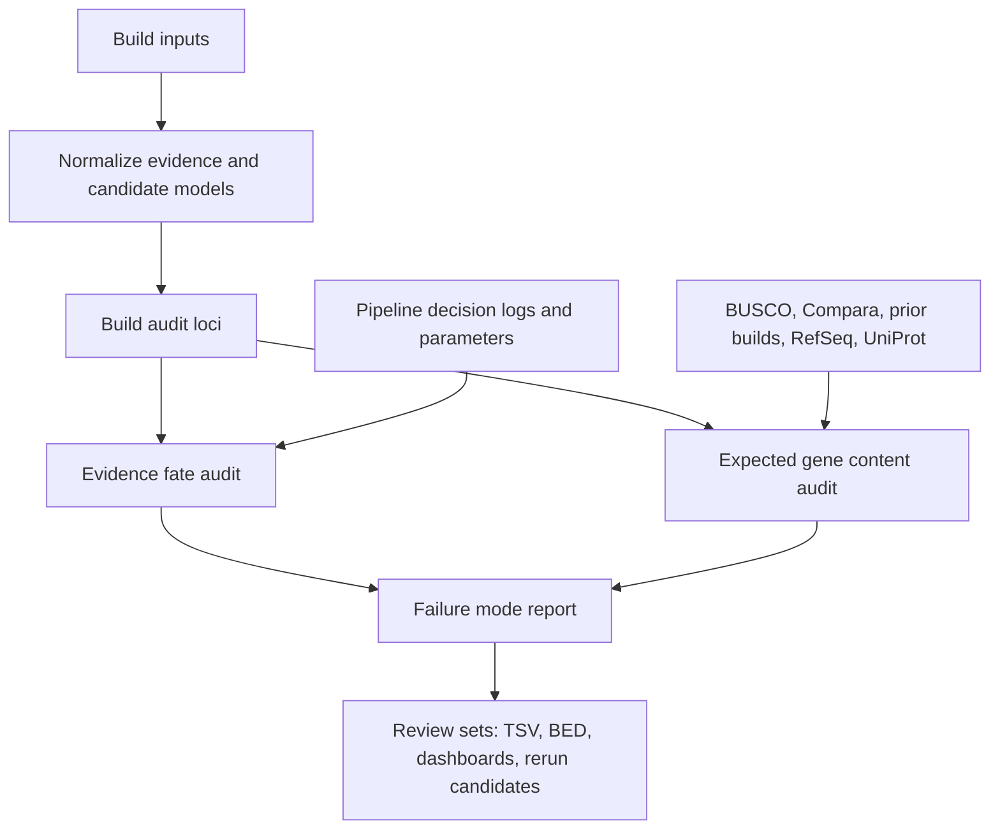

# Genebuild observability and expected gene content audit

Status: framework draft with implemented first-pass CLI

This document sketches a more comprehensive audit framework for Ensembl
genebuilds. It is written as a product and engineering brief rather than a
finished implementation spec. The aim is to move from release-time aggregate
scores to a locus-level account of what the build saw, what it emitted, what it
missed, and why.

## Core split

There are two related but distinct questions.

1. Build process audit:
   Given the evidence and candidate models available to the pipeline, how did
   we get to the final core geneset?

2. Expected gene content audit:
   Given what this species or clade should contain, are expected genes present,
   absent, degraded, duplicated, collapsed, or structurally wrong?

BUSCO belongs to the second question, but only as a biased sentinel panel of
conserved mostly single-copy protein-coding genes. It should not be treated as a
complete proxy for annotation quality, total expected gene content, or gene
structure correctness.

## Desired outcome

For a finished build, we should be able to answer these questions with concrete
rows, not anecdotes.

- Which evidence sources contributed to final genes?
- Which layer models were represented, collapsed, superseded, or ignored?
- Which expected genes were retained from a previous same-species annotation?
- Which expected genes were lost on the new assembly, and is that likely due to
  assembly, evidence, selection, projection, biotype, or parameter thresholds?
- Which gene families or biotypes systematically regress?
- Which loci are likely rescue candidates?
- Which pipeline parameters or layer movements would plausibly change the
  outcome?
- How much of a BUSCO change reflects real expected gene content change rather
  than BUSCO panel bias?

## Quality dimensions

Annotation quality is not one number. The audit should keep these dimensions
separate so a build can be good in one dimension and bad in another.

| Dimension | Question | Example failure |
| --- | --- | --- |
| Presence | Is the expected gene represented at all? | No core gene at a projected previous gene |
| Copy number | Is the expected number of copies represented? | Paralogous family collapsed to one copy |
| Structure | Are exons, introns, CDS, and splice sites correct? | BUSCO complete but intron chain wrong |
| Functionality | Does the model produce a plausible protein or non-coding transcript? | Premature stop, truncated CDS, wrong biotype |
| Canonical choice | Is the best representative transcript selected? | Non-canonical isoform satisfies BUSCO |
| Evidence fate | What happened to input evidence and candidate models? | Strong layer model rejected by competition |
| Regression | Did another assembly/build of the same species do better? | Previous gene lost on new assembly |
| Explainability | Can we identify the likely stage and reason? | Missing decision record or ambiguous source conflict |

Each final classification should ideally contain orthogonal labels rather than a
single overloaded bucket:

- `observation_state`: evidence_present, evidence_absent, unassessable
- `assembly_state`: intact, gap_limited, fragmented, uncertain
- `annotation_state`: built, missing, partial, rejected, collapsed
- `structure_state`: clean, degraded, split, fused, wrong_canonical
- `expectation_state`: high_confidence_expected, medium_confidence_expected,
  low_confidence_expected, unexpected

## Operating principles

- Locus-centric first, aggregate second.
- Never assume internal IDs are comparable across databases.
- Represent evidence fate independently from biological expectation.
- Distinguish absence from unobservability: no evidence, no assembly, rejected
  evidence, and rejected model are different states.
- Prefer transcript/exon/CDS representation over gene-span overlap.
- Preserve provenance at every step: source, analysis logic_name, pipeline tier,
  input file, version, and parameter set.
- Make every classification explainable enough for a human to inspect in a
  browser or rerun in a narrow experiment.
- Keep BUSCO as one calibrated panel, not the scoreboard.

## High-level workflow



## Input inventory

The framework should accept partial inputs. The audit is more powerful when more
sources are present, but it should still run with only core and layer databases.

### Build process inputs

| Input | Purpose | Minimum fields |
| --- | --- | --- |
| Core DB | Final annotation under audit | genes, transcripts, translations, exons, analysis, seq_region |
| Layer DB | Evidence/candidate models seen by the build | genes, transcripts, translations, exons, analysis, seq_region |
| Pipeline config | Which tiers, thresholds, and filters were used | layer order, thresholds, runnable versions |
| Candidate model dumps | Models generated before final selection | candidate id, source, score, features, rejection status |
| Decision logs | Why candidates lost or passed | stage, candidate, rule, parameter, measured value |
| Repeat/assembly masks | Context for gene loss or truncation | intervals, mask type, source |
| RNA/protein alignments | Evidence not always represented as genes | query id, target interval, identity, coverage, intron chain |

### Expected gene content inputs

| Input | Purpose |
| --- | --- |
| Previous Ensembl build for same species | Main regression baseline |
| Same-species alternate assemblies | Detect assembly-specific loss and representation drift |
| RefSeq or other reference annotation | Independent model set |
| Compara orthologues/paralogues | Expected conserved and lineage genes |
| Close-species annotations | Clade-informed expectation when same-species data is weak |
| BUSCO/OrthoDB | Conserved single-copy sentinel panel |
| UniProt/Swiss-Prot | Curated protein support and known important genes |
| RNA-seq/long-read evidence | Assembly-specific expression support |
| Assembly QC/gaps | Separate annotation loss from assembly absence |

The implemented CLI can automatically create the `expected_gene` catalogue from
another Ensembl core DB with `--expected_core_db`. It can also create
`expected_gene_projection` rows only in the safe `same_coordinates` case, where
the expected-reference DB already uses the target assembly coordinate system.
Normal old-assembly to new-assembly comparisons still need an external
projection/liftover/alignment input.

Expected annotations can also be supplied as GFF3 with `--expected_gff3`. The
GFF3 path is useful for RefSeq, collaborator annotations, prior exported
annotations, and manually curated gene sets. It follows the same coordinate
rule: a GFF3 on the audited assembly can produce expected projections directly;
a GFF3 on another assembly can only define the expected catalogue until it has
been projected or mapped.

The implemented draft now has three explicit comparison tracks:

- Same assembly annotation comparison: standardize GFF/GTF files externally,
  compare transcript structures with GffCompare, and pass the `.tmap` with
  `--gffcompare_tmap`.
- Different assembly expected-gene comparison: generate projected expected
  genes externally, or use a pre-projected DB, then audit core/layer
  representation.
- BUSCO-like protein-set comparison: map a chosen reference protein set to the
  audited assembly/proteins externally and pass the full expected protein
  denominator plus hit table with `--expected_proteins` and
  `--reference_protein_hits`.

For a recovery situation, such as an automated build with 80% BUSCO and
user-reported missing multicopy families, the release process should move into
recovery mode:

1. Freeze the current core/layer DBs and audit outputs.
2. Run expected-gene, reference-protein, copy-number, and BUSCO-gate audits.
3. Treat `release_readiness.tsv` `FAIL` rows as release blockers unless they
   are explicitly reclassified as assembly-limited.
4. Rescue only the classified failure mode: candidate rescue for local evidence,
   source/layer ordering for rejected models, protein seeding for confident
   protein hits, projection repair for mapping failures, and assembly reporting
   for gap-limited loci.
5. Rerun the audit after patching; do not release until blocker gates pass or
   have signed-off exceptions.

Prevention is the same audit moved earlier in the build lifecycle. Each
automated build should emit release gates before handover, and the handover
should include the expected catalogue/protein denominator used to make the
claim. Aggregate BUSCO should be a sentinel metric, not the release decision.

## Canonical entities

The audit should write normalized intermediate tables. These are intentionally
boring; most downstream reports should be joins over these objects.

### `audit_run`

One row per audit invocation.

- `audit_run_id`
- `species`
- `assembly_accession`
- `core_db`
- `layer_db`
- `genebuild_version`
- `software_versions`
- `parameters_hash`
- `created_at`

### `source`

One row per evidence or expectation source.

- `source_id`
- `source_kind`: core, layer, rnaseq, protein, projection, prior_ensembl,
  refseq, compara, busco, uniprot, manual
- `source_name`
- `source_version`
- `confidence_policy`
- `notes`

### `audit_locus`

Genome intervals built from the union of core models, layer models, projected
expected genes, and external high-confidence evidence.

- `locus_id`
- `seq_region_name`
- `seq_region_start`
- `seq_region_end`
- `seq_region_strand`
- `locus_mode`: strict, expanded, expectation
- `core_gene_count`
- `layer_model_count`
- `expected_gene_count`
- `evidence_source_count`

### `model`

Any gene/transcript-like object observed by the audit.

- `model_id`
- `source_id`
- `source_kind`
- `stable_id`
- `gene_id`
- `transcript_id`
- `seq_region_name`
- `start`
- `end`
- `strand`
- `biotype`
- `logic_name`
- `has_translation`
- `protein_length`
- `canonical_flag`
- `locus_id`

### `model_structure`

Feature-level structure for transcript comparison.

- `model_id`
- `transcript_id`
- `feature_kind`: exon, CDS, UTR, intron
- `rank`
- `start`
- `end`
- `phase`

### `expected_gene`

One row per gene we expect to assess on this assembly.

- `expected_gene_id`
- `expected_source`: prior_ensembl, refseq, compara, busco, uniprot, family
- `reference_stable_id`
- `symbol`
- `description`
- `biotype`
- `orthogroup_id`
- `busco_id`
- `expected_copy_number`
- `confidence`: high, medium, low
- `confidence_reason`
- `is_single_copy_expected`
- `is_clade_specific`
- `is_same_species_reference`

### `expected_gene_projection`

Mapping from expected gene to the assembly under audit.

- `expected_gene_id`
- `projection_source`
- `target_seq_region_name`
- `target_start`
- `target_end`
- `target_strand`
- `projection_status`: mapped, split, multi_map, partial, unmapped
- `projection_identity`
- `projection_coverage`
- `assembly_gap_overlap_bp`
- `repeat_overlap_bp`
- `locus_id`

### `representation_match`

Pairwise comparison between an evidence/expected model and a core model.

- `query_model_id`
- `target_core_model_id`
- `locus_id`
- `match_class`: exact_intron_chain, near_intron_chain, intron_subset,
  exon_covered, CDS_covered, span_overlap_only, no_match
- `exon_jaccard`
- `intron_recall`
- `intron_precision`
- `CDS_coverage`
- `protein_length_ratio`
- `splice_delta_max_bp`
- `same_strand`
- `same_biotype`

### `decision_event`

Instrumented build decision, where available.

- `decision_event_id`
- `stage`: evidence_load, filter, model_generation, scoring, competition,
  collapse, biotype_assignment, canonical_selection, final_write
- `candidate_model_id`
- `locus_id`
- `rule_name`
- `parameter_name`
- `parameter_value`
- `observed_value`
- `outcome`: passed, failed, selected, rejected, superseded, collapsed
- `reason_code`

## Audit 1: evidence and model fate

This audit follows material observed by the pipeline and asks what happened to
it. It is not trying to decide whether the species should have had the gene in
the first place.

### Fate classes

| Fate | Meaning |
| --- | --- |
| `represented_exact` | Final core transcript has the same intron chain and compatible CDS |
| `represented_near` | Splice sites are within tolerance or transcript is a valid subset |
| `represented_partial` | Core overlaps and captures part of the evidence, but loses structure |
| `collapsed_into_core` | Multiple evidence models were represented by one final model |
| `superseded_by_higher_tier` | Lower-tier model lost to a better-supported model |
| `rejected_by_filter` | Failed an explicit rule or threshold |
| `rejected_by_competition` | Passed initial filters but lost locus selection |
| `orphan_evidence` | Evidence exists but no core model represents it |
| `ambiguous_multimapping` | Evidence maps to multiple loci or paralogues |
| `not_assessed` | Missing required structure or provenance |

### Required comparisons

- Gene span overlap
- Transcript span overlap
- Intron-chain exact match
- Intron-chain near match with splice tolerance
- Intron subset/superset relationship
- Single-exon transcript coverage
- CDS base coverage
- Protein length and stop-codon sanity
- Same-strand and opposite-strand core occupancy
- Biotype and logic_name transitions
- Canonical transcript representation

### Process stages to capture

The current RGB branch can compare layer and core after the fact. To diagnose
parameters properly, we also need stage-specific hooks or exported decision
tables.

| Stage | Example questions |
| --- | --- |
| Evidence ingest | Did the source enter the layer DB at all? |
| Pre-filter | Was evidence removed by coverage, identity, repeat, or length? |
| Model generation | Was a transcript/protein model produced from the evidence? |
| Scoring | What score did each candidate receive? |
| Competition | Which candidate won at the locus and why? |
| Collapse | Were similar transcripts collapsed too aggressively? |
| Biotype assignment | Was coding evidence labelled non-coding or pseudogene? |
| Canonical selection | Did a better protein-coding isoform lose canonical status? |
| Final write | Did the model fail final checks or release filters? |

### Failure classes

These classes should be assigned per locus and per affected model, with
supporting measurements.

| Failure class | Typical evidence |
| --- | --- |
| `no_core_gene_built` | Layer or expected evidence exists, but no core gene overlaps |
| `evidence_not_loaded` | Expected source exists externally but not in layer |
| `evidence_filtered_low_identity` | Decision event or alignment metric below threshold |
| `evidence_filtered_low_coverage` | Query/target coverage below threshold |
| `evidence_filtered_repeat` | Repeat/low-complexity overlap caused rejection |
| `model_generation_failed` | Evidence loaded but no candidate transcript produced |
| `coding_model_lost` | Coding candidate lost to non-coding or shorter model |
| `wrong_biotype` | Strong coding evidence but final core is non-coding/pseudogene |
| `wrong_canonical` | Non-canonical isoform satisfies expected gene better than canonical |
| `overcollapsed_transcripts` | Distinct supported isoforms collapsed into one |
| `fragmented_model` | Core captures pieces but loses exons/CDS/introns |
| `split_gene` | One expected gene represented by multiple core genes |
| `fused_gene` | Multiple expected genes represented by one core gene |
| `readthrough_candidate` | Adjacent expected genes fused with weak boundary evidence |
| `paralogue_collapse` | Multiple expected copies represented by one core copy |
| `paralogue_overexpansion` | Expected single copy becomes many weak duplicates |
| `assembly_gap_limited` | Missing/degraded locus overlaps assembly gap or poor sequence |
| `evidence_absent_on_assembly` | Expected gene projects poorly and has no expression/protein evidence |
| `possible_true_loss` | Projection/evidence absent, no assembly issue, clade biology plausible |
| `unresolved_conflict` | Sources disagree and no confident call is possible |

### Evidence fate report

Primary table: `evidence_fate.tsv`

Suggested columns:

- `locus_id`
- `source_kind`
- `source_name`
- `logic_name`
- `model_id`
- `stable_id`
- `biotype`
- `has_translation`
- `best_core_gene_id`
- `best_core_transcript_id`
- `representation_class`
- `fate_class`
- `failure_class`
- `intron_recall`
- `CDS_coverage`
- `protein_length_ratio`
- `decision_stage`
- `decision_reason_code`
- `review_priority`

Aggregates:

- Fate by `source_kind`, `logic_name`, layer tier, and biotype.
- Loss by stage.
- Loss by chromosome/scaffold.
- Collapse rate by evidence source.
- Coding evidence lost to non-coding final models.
- Candidate rescue loci ranked by confidence and likely fixability.

## Audit 2: expected gene content

This audit asks whether the annotation contains the genes it should contain.
The unit is not a BUSCO id; it is a reference-informed expected gene object.

### Expected gene catalogue

Build a species/clade-specific catalogue from multiple sources. Each expected
gene gets a confidence score and a reason, not just a yes/no label.

| Source | Strength | Weakness |
| --- | --- | --- |
| Previous same-species Ensembl build | Best regression baseline | Can preserve previous annotation mistakes |
| Same-species alternate assemblies | Good for assembly-specific comparison | Requires projection/mapping quality control |
| RefSeq or other curated annotation | Independent model set | Different conventions and release timing |
| Compara orthologues | Broad conserved expectation | Orthology can be ambiguous in duplications |
| Close species annotations | Useful when same-species data is weak | Risk of clade-specific gain/loss errors |
| UniProt/Swiss-Prot | High-quality protein support | Biased toward studied genes |
| BUSCO/OrthoDB | Conserved sentinel panel | Small, biased, mostly single-copy coding genes |
| RNA-seq or long-read evidence | Assembly-specific support | Expression absence is not gene absence |
| Known family panels | Captures important expansions | Requires curated family definitions |

### Catalogue construction

The expected catalogue should be built as a merge of source assertions. A source
assertion says "this gene or orthogroup is expected here" with an identifier,
evidence type, support strength, and expected copy number if known.

Suggested source assertion fields:

- `assertion_id`
- `source_id`
- `reference_gene_id`
- `orthogroup_id`
- `symbol`
- `biotype`
- `expected_copy_number`
- `support_type`: same_species, orthology, protein, expression, marker, family
- `support_strength`: numeric score from 0 to 1
- `source_confidence`: high, medium, low
- `known_risk`: duplicated_family, rapidly_evolving, assembly_sensitive,
  annotation_convention_sensitive

Merge logic:

1. Group assertions by stable same-species gene id where possible.
2. Otherwise group by orthogroup plus reciprocal best mapping and protein
   similarity.
3. Keep source-specific assertions, even after grouping, so disagreement is
   visible.
4. Derive a catalogue confidence from support type, number of independent
   sources, same-species evidence, and projection quality.
5. Derive expected copy number separately from presence confidence.

Example confidence policy:

| Evidence pattern | Confidence |
| --- | --- |
| Previous same-species Ensembl gene projects cleanly and has protein/RNA support | High |
| Previous same-species gene projects cleanly but no local expression is available | High or medium, depending on biotype and assembly context |
| RefSeq and Ensembl agree but projection is partial | Medium |
| Conserved one-to-one orthologue in close species with local protein/RNA support | Medium |
| BUSCO-only expectation | Medium for conserved coding presence, low for broader gene content |
| Family-level expectation without locus-specific support | Low |
| Conflicting paralogue or copy-number evidence | Low or unresolved |

### Confidence levels

| Confidence | Criteria |
| --- | --- |
| High | Same-species previous/reference gene with good projection, or conserved orthologue with strong protein/RNA support |
| Medium | Close-species expected gene or weaker projection with supporting evidence |
| Low | Weak orthology, family expectation, or conflicting sources |

### Presence classes

| Presence class | Meaning |
| --- | --- |
| `present_clean` | Expected gene has a structurally compatible core model |
| `present_degraded` | Core model exists but loses structure/CDS/protein length |
| `present_wrong_canonical` | Gene exists, canonical transcript does not represent expected model |
| `present_wrong_biotype` | Gene exists but biotype is incompatible with evidence |
| `split` | One expected gene maps to multiple core genes |
| `fused` | Multiple expected genes map to one core gene |
| `duplicated_expected` | Observed copy number matches expected expansion |
| `duplicated_unexpected` | More core copies than expected |
| `collapsed_copy_number` | Fewer core copies than expected for paralogous family |
| `projection_only` | Expected gene maps to assembly, but final core lacks it |
| `evidence_only` | RNA/protein evidence exists, but no expected/reference projection |
| `missing_with_evidence` | Expected gene and evidence exist, but core lacks it |
| `missing_no_evidence` | Expected gene projects weakly and no local evidence is found |
| `assembly_limited` | Missing or degraded due to gap, truncation, contamination, or low quality sequence |
| `possible_true_absence` | No convincing assembly/evidence support and loss is biologically plausible |
| `unresolved` | Conflicting evidence prevents a confident call |

### Expected gene report

Primary table: `expected_gene_presence.tsv`

Suggested columns:

- `expected_gene_id`
- `expected_source`
- `reference_stable_id`
- `symbol`
- `biotype`
- `orthogroup_id`
- `busco_id`
- `expected_copy_number`
- `confidence`
- `projection_status`
- `projection_coverage`
- `assembly_gap_overlap_bp`
- `best_core_gene_id`
- `best_core_transcript_id`
- `presence_class`
- `structure_class`
- `copy_number_class`
- `failure_class`
- `review_priority`
- `evidence_summary`

Aggregates:

- Expected gene retention by confidence.
- Same-species gene loss by biotype and chromosome.
- Protein-coding loss split by assembly-limited vs build-limited.
- Copy-number errors by gene family.
- BUSCO status cross-tabbed against expected gene presence class.
- Non-BUSCO expected genes missed despite strong support.

## Same-species assembly regression audit

This deserves first-class treatment. When annotating another assembly of the
same species, the default expectation should be that most established genes are
retained unless the assembly, haplotype, or biology gives a reason otherwise.

### Workflow

1. Take previous same-species Ensembl annotation as the baseline.
2. Project genes/transcripts/proteins onto the new assembly using the available
   assembly mapping or whole-genome/protein alignment workflow.
3. Compare projected expected loci to the new core geneset.
4. Add RNA/protein/layer support at each projected locus.
5. Classify loss or degradation.
6. Summarize by gene, family, biotype, source, chromosome, and assembly quality.

### Regression classes

| Regression class | Meaning |
| --- | --- |
| `retained_clean` | New core matches previous gene structure well |
| `retained_minor_structure_change` | Small splice/CDS changes but broadly intact |
| `retained_degraded` | Protein/CDS/exon structure materially worse |
| `lost_but_projected` | Previous gene maps to new assembly but no core model |
| `lost_with_layer_evidence` | Projected or local evidence exists, but not built |
| `lost_no_local_evidence` | Projection weak and no layer evidence |
| `lost_assembly_gap` | Projection overlaps gap or truncated assembly region |
| `split_in_new_build` | Previous gene split across multiple core genes |
| `fused_in_new_build` | Previous adjacent genes fused |
| `copy_number_changed` | Paralog count changed relative to expectation |
| `biotype_changed` | Coding/non-coding/pseudogene state changed |
| `canonical_regressed` | Better representative isoform exists but is not canonical |

### Regression gates

Use release-blocking or review-triggering gates before sign-off:

- High-confidence same-species protein-coding gene losses above threshold.
- BUSCO losses accompanied by broader expected-gene losses.
- Any chromosome with concentrated projected gene loss.
- Family-level copy-number collapse for known important families.
- High-confidence genes changing to non-coding without assembly evidence.
- Large increase in split/fused genes relative to previous build.

## BUSCO assessment inside the expected-gene framework

BUSCO should be evaluated, not trusted blindly.

### What BUSCO is good for

- Detecting severe annotation failure.
- Catching wrong lineage selection.
- Flagging conserved coding genes that are missing or fragmented.
- Comparing builds when lineage, mode, and input conventions are identical.

### What BUSCO is not good for

- Total expected gene count.
- Lineage-specific genes.
- Gene family expansions.
- Rapidly evolving genes.
- Immune, olfactory, reproductive, and other expansion-prone families.
- Non-coding genes.
- Alternative splicing.
- Detailed exon/CDS structure.
- Same-species assembly-to-assembly regression outside conserved single-copy
  genes.

### How to quantify BUSCO as a proxy

For species with mature annotations, run a calibration analysis:

1. Build the full expected gene catalogue.
2. Mark which expected genes are BUSCO genes.
3. Compare BUSCO missing/fragmented calls to expected-gene missing/degraded
   calls.
4. Compute:
   - sensitivity: fraction of high-confidence losses detected by BUSCO
   - specificity: fraction of BUSCO failures that are real expected-gene issues
   - bias: which biotypes, families, and expression classes BUSCO ignores
   - copy-number blind spots: expected duplications not represented by BUSCO
   - structure blind spots: degraded structures with BUSCO still complete
5. Report cases where BUSCO is clean but high-confidence expected genes are lost.

Additional calibration views:

- `BUSCO coverage of catalogue`: fraction of high-confidence expected genes that
  are represented by a BUSCO marker or close orthogroup.
- `BUSCO family bias`: enrichment/depletion of BUSCO genes by gene family,
  pathway, expression breadth, and evolutionary rate.
- `BUSCO copy-number blind spot`: families where BUSCO expects one copy but the
  species or clade expects multiple biologically real copies.
- `BUSCO false reassurance`: builds with high BUSCO completeness but poor
  same-species retention or many non-BUSCO high-confidence losses.
- `BUSCO overreaction`: BUSCO failures where the expected catalogue indicates
  true absence, assembly absence, lineage mismatch, or marker unsuitability.

The proxy question should be measured in two directions:

- Does BUSCO failure predict broader expected-gene loss?
- Does expected-gene loss happen when BUSCO remains clean?

### BUSCO report outputs

- `busco_expected_gene_crosswalk.tsv`
- `busco_failure_audit.tsv`
- `busco_proxy_calibration.tsv`
- `non_busco_high_confidence_losses.tsv`

The important release question becomes:

> Are BUSCO failures isolated sentinel events, or do they predict broader loss in
> the expected gene catalogue?

## Parameter and layer movement analysis

The system should not only diagnose failures. It should suggest plausible
interventions.

### Parameter sensitivity

For each rejected candidate, record observed values near thresholds.

Examples:

- protein alignment coverage: observed 0.78, threshold 0.80
- intron support count: observed 1, threshold 2
- ORF length: observed 87 aa, threshold 100 aa
- transcript overlap redundancy: observed 0.91, threshold 0.90
- splice confidence: observed 0.69, threshold 0.70

Report:

- near-threshold rejects by rule
- high-confidence expected genes affected by each threshold
- thresholds causing large source-specific losses
- loci to rerun with relaxed or stricter parameters

### Layer movement analysis

For every source or biotype, estimate whether moving it earlier/later would have
changed outcomes.

Outputs:

- models lost to higher-tier competitors
- high-confidence lower-tier models that better represent expected genes than
  the winner
- sources that mostly add noise
- sources that rescue high-confidence expected genes
- sources that should become review-only rather than build-driving

This should be reported conservatively. A layer movement suggestion should point
to concrete loci and measurements, not just a global source count.

## Review prioritization

Every problem row should get a review priority, because a genome-wide report can
easily become unreadable.

### Priority score components

- Expected gene confidence.
- Same-species regression status.
- Protein-coding or curated importance.
- BUSCO/orthogroup support.
- RNA/protein/layer evidence strength on the new assembly.
- Assembly quality at locus.
- Structural severity.
- Fixability: likely parameter/layer/canonical issue vs likely assembly absence.
- Number of releases/species affected by the same pattern.

### Suggested priority bands

| Band | Meaning |
| --- | --- |
| P0 | Release-blocking systematic issue or many high-confidence losses |
| P1 | High-confidence expected gene lost/degraded with evidence and likely fix |
| P2 | Medium-confidence loss or local structural regression |
| P3 | Low-confidence, ambiguous, or review-only observation |

## Command shape

The current `rgb` tool can grow into this, but the commands should reflect the
two audit tracks.

```text
rgb extract-build-inputs ...
rgb build-loci ...
rgb audit-evidence-fate ...
rgb build-expected-catalogue ...
rgb audit-expected-presence ...
rgb audit-same-species-regression ...
rgb audit-busco-proxy ...
rgb rank-review-loci ...
rgb export-review ...
```

For initial implementation, these can be thinner wrappers around TSV/Parquet
tables. The important part is to make the table contracts stable.

## Minimum viable implementation

The first useful version should avoid requiring full pipeline instrumentation.

### M1: after-the-fact genome-wide accounting

- Fix RGB correctness issues.
- Extract core and layer genes/transcripts/translations/exons.
- Build strict and expanded loci.
- Compute transcript-level representation from layer to core.
- Produce `evidence_fate.tsv` with coarse fate classes.
- Export high-confidence orphan and underrepresented loci as BED.

### M2: reference-informed expected gene content

- Add previous same-species annotation as an expected source.
- Add BUSCO crosswalk where available.
- Add projection or alignment intervals for previous genes.
- Compare expected genes to core using representation metrics.
- Produce `expected_gene_presence.tsv`.
- Produce same-species regression summary.

### M3: BUSCO proxy calibration

- Fold the BUSCO audit into the expected-gene framework.
- Cross-tab BUSCO states against expected gene presence classes.
- Report non-BUSCO high-confidence losses.
- Report BUSCO-complete but structurally degraded cases.

### M4: pipeline decision ledger

- Add optional ingestion of candidate model dumps and rejection logs.
- Add `decision_event.tsv`.
- Assign failure stage and threshold sensitivity.
- Produce parameter and layer movement reports.

### M5: release gates and dashboards

- Define thresholds per clade/build type.
- Add release comparison reports.
- Add stable summary pages and machine-readable JSON.

## Table output set

Minimum outputs:

- `manifest.json`
- `audit_loci.tsv`
- `models.tsv`
- `model_structure.tsv`
- `representation_matches.tsv`
- `evidence_fate.tsv`
- `expected_genes.tsv`
- `expected_gene_projection.tsv`
- `expected_gene_presence.tsv`
- `same_species_regression.tsv`
- `busco_expected_crosswalk.tsv`
- `failure_mode_summary.tsv`
- `review_loci.tsv`
- `review_loci.bed`

Optional outputs:

- `decision_events.tsv`
- `parameter_sensitivity.tsv`
- `layer_movement_candidates.tsv`
- `copy_number_audit.tsv`
- `canonical_regression.tsv`
- `biotype_transition.tsv`

## Browser and manual review assets

Every top issue should link to reviewable genomic intervals.

Export:

- BED for missing high-confidence genes.
- BED for underbuilt loci.
- BED for split/fused candidates.
- BED for same-species regressions.
- BigBed or GFF tracks for expected gene projections.
- Per-locus HTML/Markdown summaries if useful.

Each review locus should include:

- coordinates
- expected gene ids
- best core match
- best layer evidence
- representation metrics
- likely failure class
- suggested next action

## Suggested next action labels

- `inspect_browser`
- `rerun_with_candidate_rescue`
- `try_alternative_canonical`
- `relax_threshold_locally`
- `move_source_layer`
- `add_reference_projection`
- `check_assembly_gap`
- `check_paralogue_family`
- `mark_possible_true_loss`
- `needs_manual_curation`

## Risks

| Risk | Mitigation |
| --- | --- |
| Expected catalogue overcalls false losses | Confidence levels and source conflict tracking |
| Prior annotation errors become ground truth | Independent RefSeq/Compara/UniProt support and conflict labels |
| Projection failures look like gene loss | Keep projection status separate from annotation presence |
| Reports become too large | Priority bands, aggregate summaries, and browser-ready review sets |
| Pipeline lacks decision logs | Start after-the-fact, then add optional decision_event ingestion |
| BUSCO dominates narrative again | Treat BUSCO as a calibrated panel in the expected catalogue |
| Threshold suggestions are overinterpreted | Require concrete near-threshold evidence and review examples |

## Open design questions

- Which previous build should be the default same-species baseline?
- What projection method should be canonical for same-species regression?
- How should expected copy number be derived for duplicated families?
- Which clade-specific gene family panels are worth curating first?
- What build stages can realistically emit decision events?
- Can existing Hive pipeline logs be normalized enough for `decision_event.tsv`?
- What release gates are acceptable for fragmented assemblies?
- How should manual review decisions feed back into future expected catalogues?

## Draft acceptance criteria

A draft implementation is useful when it can do the following for one species:

- Produce genome-wide layer-to-core representation metrics.
- Identify high-confidence layer evidence with no core representation.
- Build a same-species expected gene set from a previous annotation.
- Classify retained, lost, degraded, split, fused, and assembly-limited genes.
- Cross-tab BUSCO failures with broader expected-gene failures.
- Export top review loci with actionable failure classes.
- Show at least one concrete parameter/layer/canonical intervention candidate.

## Relationship to existing branches

The reverse gene builder branch is the better backbone because it already starts
from genome-wide core/layer extraction and locus construction. It needs to move
from span/count metrics to transcript/CDS/protein representation and stable
table contracts.

The BUSCO audit branch should be folded in as a BUSCO diagnostic module. Its
main value is targeted explanation of BUSCO genome-vs-protein disagreements,
especially canonical/protein issues. It should not own the overall completeness
story.
